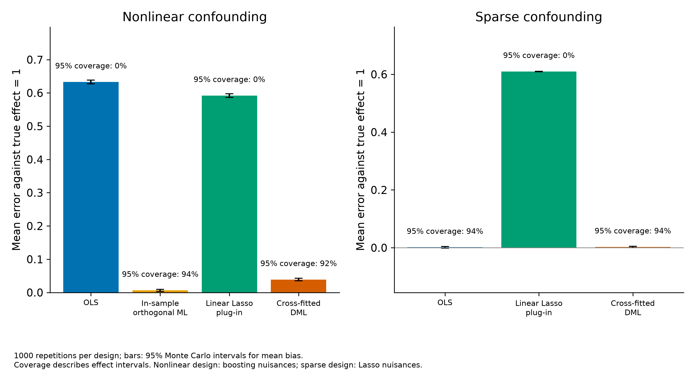

# Causal ML: shrinkage and identification

When can regularization distort a treatment effect, and what assumptions remain?

We compare unchanged estimators in two fixed simulations with known effects. We increase Monte Carlo precision and add overlap and confounding-sensitivity diagnostics to the historical SIPP replication. We retain the original staggered-adoption analysis and add a narrowly supported, balanced late-cohort window.

- In 1,000 sparse-design repetitions, linear Lasso plug-in bias is 0.610, versus 0.003 for cross-fitted DML; nominal 95% coverage is 0.0% versus 93.8%.
- The nonlinear design qualifies that message: in-sample orthogonal ML bias is 0.007, versus 0.039 for cross-fitted DML. These fixed learner/design comparisons do not establish universal DML superiority.
- The historical RF–IRM estimate remains $8,172. No observations are trimmed; sensitivity RV is 8.41% and RVa 4.94% under the specified adversarial confounding model, not proof of no confounding.

## Limitations

- Designs and learner families differ; rankings are not universal.
- IPW ESS measures weight concentration, not causal validity or propensity-estimation uncertainty.
- Historical eligibility is not randomized or modern policy participation.
- Balanced and full-sample event studies target different cohorts/windows.
- Effect and group inference conditions on fitted nuisance structures.

## Technical notes

V3 protocol: docs/V3_PROTOCOL.md. Original V2 artifacts and SHA256 ledger: versions/v2-2026-10-07/. New Monte Carlos preserve DGPs, penalties, sample sizes, estimator/fold settings and seed sequences. Each of three separately allocated ten-minute blocks completed 1000 matched repetitions: old100 reused only after seed/draw verification and deterministic endpoint replays, new900 executed. Python nonlinear block includes its associated Python DiD runner; Python and R draws are not pooled. Checkpoints remain private. Fit failures, runtimes, counts and stop rules are exported in results/v3_*mc_manifest.json. Coverage MCSE=sqrt(p(1-p)/R), with Wilson95 intervals; MCSE zero at endpoints is not certainty.

SIPP three IRM refits recover raw out-of-fold probabilities from fitted objects with original folds/learners. RF estimate unchanged; Lasso numerical difference only (results/v3_irm_refit_comparison.csv). RF clips 54/9915 predictions; removes0 observations. IPW ESS=(sum w)^2/sum(w^2), w=1/m_clip treated,1/(1-m_clip) controls; RF treated ESS=1130.549, controls=5213.286. Raw distributions and all learner/arm counts are shown separately. Clipping is not trimming. IPW ESS is a weight-concentration diagnostic; it does not include propensity-estimation uncertainty and is not a measure of causal validity.

DoubleML sensitivity for RF–IRM ATE uses the fixed16-pair grid cf_y,cf_d in .01,.03,.05,.10;rho1,95% level,null0. cf_y is the share of outcome residual variance attributable to latent confounding; IRM cf_d is a relative gain in average conditional treatment precision/Riesz variance, not the PLR treatment R-squared. RV equal-strength effect-bound threshold=0.084107, RVa confidence-bound threshold=0.049404. Confidence endpoints are 95% one-sided limits on effect bounds. The exercise presumes this confounding model and is no proof of exchangeability. Definitions: https://docs.doubleml.org/stable/guide/sensitivity.html .

Late-cohort balanced-window comparison retains cohorts2006/2007 and events-2,-1,0; weights fixed by cohort size, never-treated controls and unchanged ATT(g,t) fits. Influence functions form constant-weight contrasts against-1. It targets a different cohort/window population than the original dynamic analysis. Original HonestDiD results apply only to the original estimand/composition. balance_e concerns post-treatment exposure, not proof of balanced pre-treatment support (official did aggte documentation). Income-quartile groups preserve their estimates: the V3 rule is right-closed pandas qcut4 on the original held-out income sample; cutoffs are empirically computed, not retrospectively pre-specified numeric thresholds or forest-discovered groups.

Sparse treatment loading1.5 makes treatment correlated with the five confounders. The plug-in projects Y and X off intercept/treatment before fixed-penalty Lasso. Population projected active covariance=0.081633 is below the unchanged penalty=0.132895; shrinkage can omit the confounder signal and return omitted-confounder bias near the unadjusted population value=0.612245. Actual finite-sample plug-in bias=0.609943. This algebra explains the declared design, not a universal ranking. No penalty was changed.

Inherited pension/forest/groups/MPDTA/HonestDiD/dose estimates remain in original files; V3 adds diagnostics, precision and the balanced estimand. All raw rows, probability predictions and fitted objects remain private; no paid calls or publication.

Limitations and future work: Matched-learner, scaling, oracle and fold factorials; denser/correlated or p>=n DGPs and heteroskedastic inference; fuller Monte Carlo uncertainty for RMSE and average estimated SE; nuisance-score concentration and observed-confounding benchmarks; clipping-grid/repeated-split/DAG-control sensitivity; alternative historical wealth outcomes and transportability; income-quartile contrasts and forest-ranked groups; estimator comparisons with identical covariates; new balanced-target HonestDiD sensitivity and pretrend-power studies; observational continuous-dose identification. These substantive review extensions are deferred, with no new tuning or target changes.

Sources: fixed seeded experiments; private public-SIPP/MPDTA retention. Aggregate V3 CSVs and inherited pension.csv.
